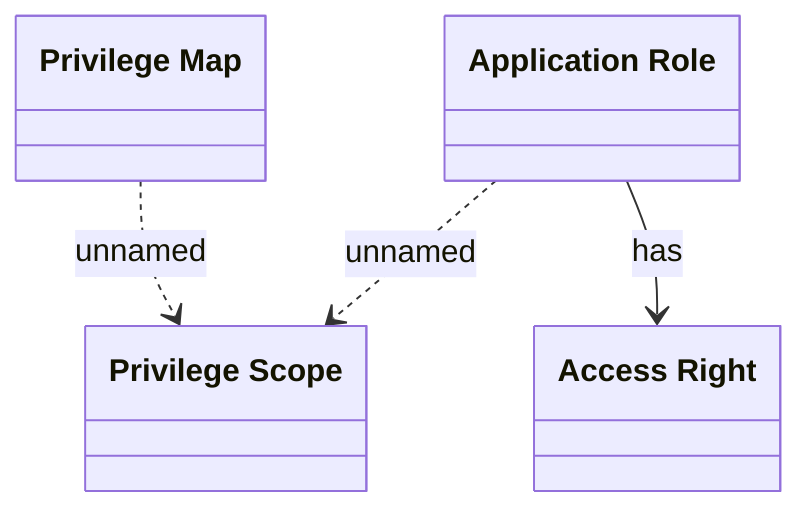

# Access control

- **Diagram Type**: Logical
- **Package**: HomerSelect/BSL/Analysis Model/COMMON for BSL/Access control/Logical Data Model
- **Diagram ID**: 81426
- **Elements**: 4
- **Connectors**: 3

