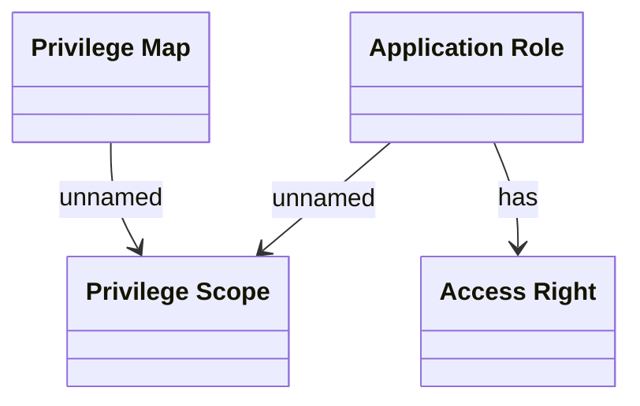

# Access control

```mermaid
classDiagram
    class Privilege_Map["Privilege Map"]
    class Access_Right["Access Right"]
    class Privilege_Scope["Privilege Scope"]
    class Application_Role["Application Role"]
    Privilege_Map --> Privilege_Scope : unnamed
    Application_Role --> Privilege_Scope : unnamed
    Application_Role --> Access_Right : has
```
