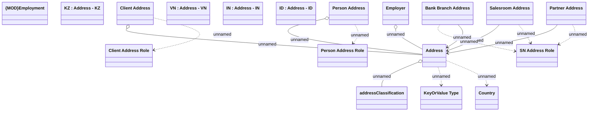

# Address - CORE

- **Diagram Type**: Logical
- **Package**: HomerSelect/BSL/Analysis Model/COMMON for BSL/Address/Logical Data Model
- **Diagram ID**: 121810
- **Elements**: 19
- **Connectors**: 14

