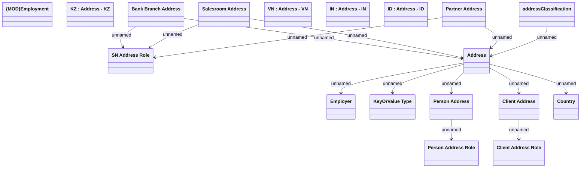

# Address - CORE

```mermaid
classDiagram
    class MOD_Employment["{MOD}Employment"]
    class KZ_Address_KZ["KZ : Address - KZ"]
    class addressClassification["addressClassification"]
    class Bank_Branch_Address["Bank Branch Address"]
    class VN_Address_VN["VN : Address - VN"]
    class IN_Address_IN["IN : Address - IN"]
    class ID_Address_ID["ID : Address - ID"]
    class Employer["Employer"]
    class KeyOrValue_Type["KeyOrValue Type"]
    class Client_Address_Role["Client Address Role"]
    class Client_Address["Client Address"]
    class Person_Address_Role["Person Address Role"]
    class SN_Address_Role["SN Address Role"]
    class Salesroom_Address["Salesroom Address"]
    class Partner_Address["Partner Address"]
    class Person_Address["Person Address"]
    class Address["Address"]
    class Country["Country"]
    Address --> Country : unnamed
    Address --> KeyOrValue_Type : unnamed
    addressClassification --> Address : unnamed
    Client_Address --> Client_Address_Role : unnamed
    Partner_Address --> SN_Address_Role : unnamed
    Partner_Address --> Address : unnamed
    Salesroom_Address --> SN_Address_Role : unnamed
    Salesroom_Address --> Address : unnamed
    Bank_Branch_Address --> Address : unnamed
    Bank_Branch_Address --> SN_Address_Role : unnamed
    Person_Address --> Person_Address_Role : unnamed
    Address --> Person_Address : unnamed
    Address --> Client_Address : unnamed
    Address --> Employer : unnamed
```
