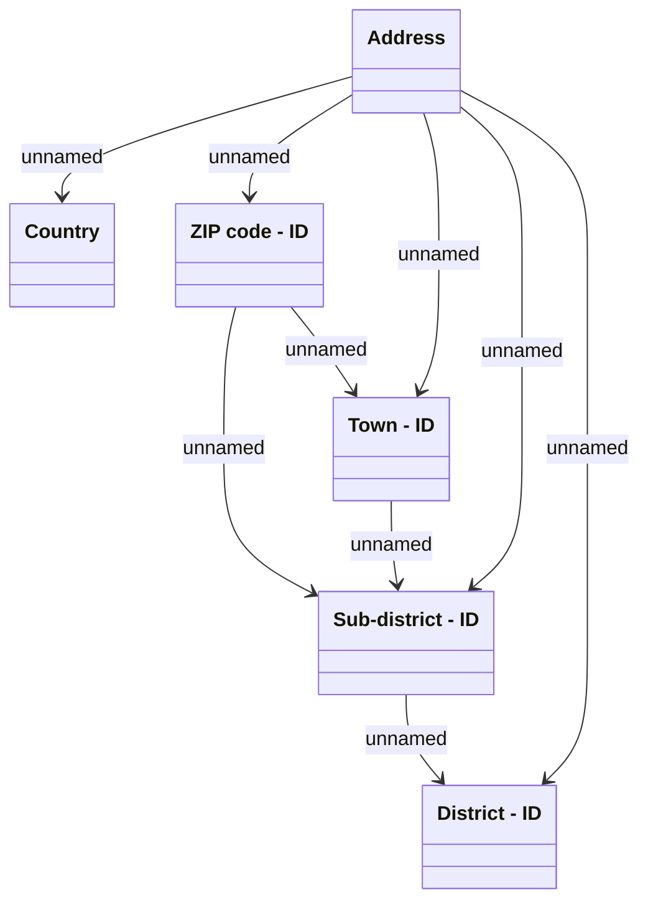

# Address - ID

```mermaid
classDiagram
    class Country["Country"]
    class Address["Address"]
    class ZIP_code_ID["ZIP code - ID"]
    class Town_ID["Town - ID"]
    class Sub_district_ID["Sub-district - ID"]
    class District_ID["District - ID"]
    Sub_district_ID --> District_ID : unnamed
    ZIP_code_ID --> Sub_district_ID : unnamed
    Town_ID --> Sub_district_ID : unnamed
    ZIP_code_ID --> Town_ID : unnamed
    Address --> Country : unnamed
    Address --> Town_ID : unnamed
    Address --> District_ID : unnamed
    Address --> Sub_district_ID : unnamed
    Address --> ZIP_code_ID : unnamed
```
