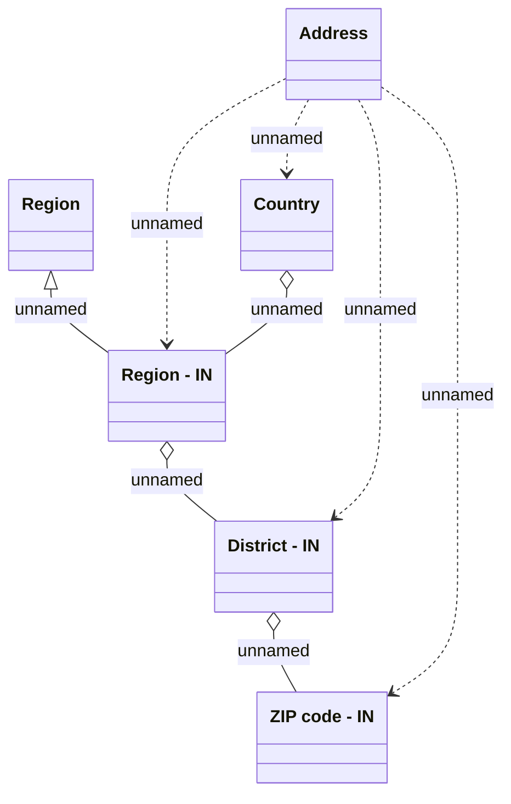

# Address - IN

- **Diagram Type**: Logical
- **Package**: HomerSelect/BSL/Analysis Model/COMMON for BSL/Address/Logical Data Model/IN
- **Diagram ID**: 53326
- **Elements**: 6
- **Connectors**: 8

