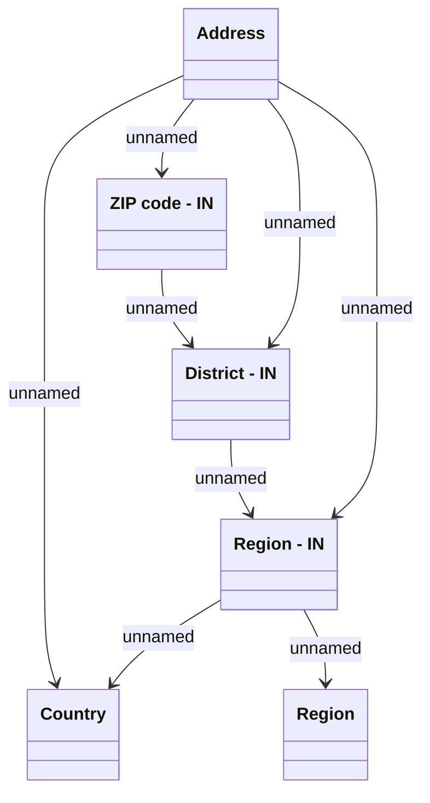

# Address - IN

```mermaid
classDiagram
    class Region["Region"]
    class ZIP_code_IN["ZIP code - IN"]
    class District_IN["District - IN"]
    class Address["Address"]
    class Region_IN["Region - IN"]
    class Country["Country"]
    Region_IN --> Region : unnamed
    District_IN --> Region_IN : unnamed
    ZIP_code_IN --> District_IN : unnamed
    Address --> Country : unnamed
    Address --> ZIP_code_IN : unnamed
    Address --> Region_IN : unnamed
    Address --> District_IN : unnamed
    Region_IN --> Country : unnamed
```
