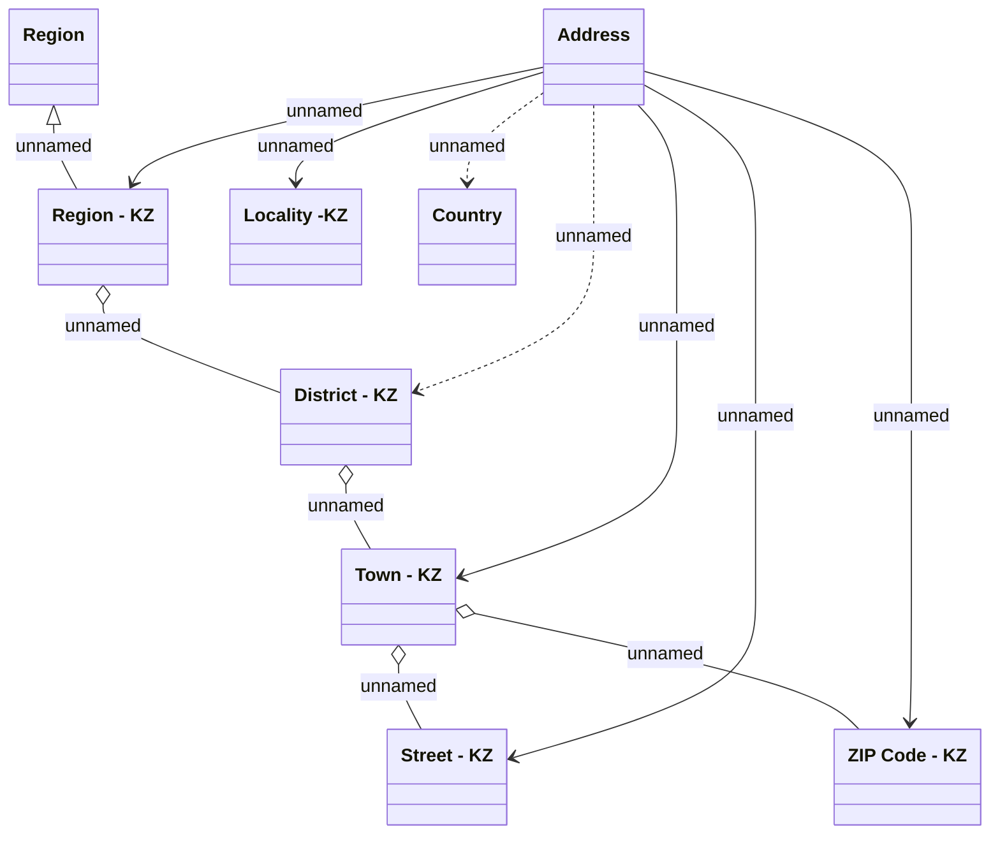

# Address - KZ

- **Diagram Type**: Logical
- **Package**: HomerSelect/BSL/Analysis Model/COMMON for BSL/Address/Logical Data Model/KZ
- **Diagram ID**: 111694
- **Elements**: 9
- **Connectors**: 12

