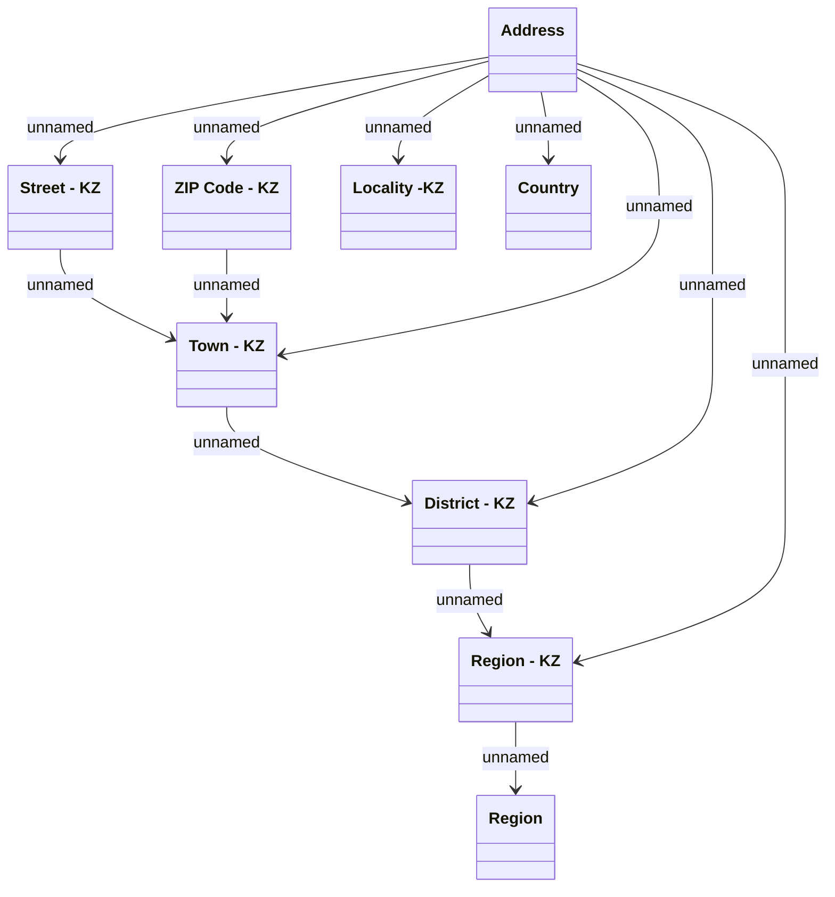

# Address - KZ

```mermaid
classDiagram
    class ZIP_Code_KZ["ZIP Code - KZ"]
    class Street_KZ["Street - KZ"]
    class Region_KZ["Region - KZ"]
    class Town_KZ["Town - KZ"]
    class Locality_KZ["Locality -KZ"]
    class District_KZ["District - KZ"]
    class Region["Region"]
    class Country["Country"]
    class Address["Address"]
    Region_KZ --> Region : unnamed
    Town_KZ --> District_KZ : unnamed
    Street_KZ --> Town_KZ : unnamed
    ZIP_Code_KZ --> Town_KZ : unnamed
    District_KZ --> Region_KZ : unnamed
    Address --> Country : unnamed
    Address --> Town_KZ : unnamed
    Address --> ZIP_Code_KZ : unnamed
    Address --> Street_KZ : unnamed
    Address --> Region_KZ : unnamed
    Address --> Locality_KZ : unnamed
    Address --> District_KZ : unnamed
```
