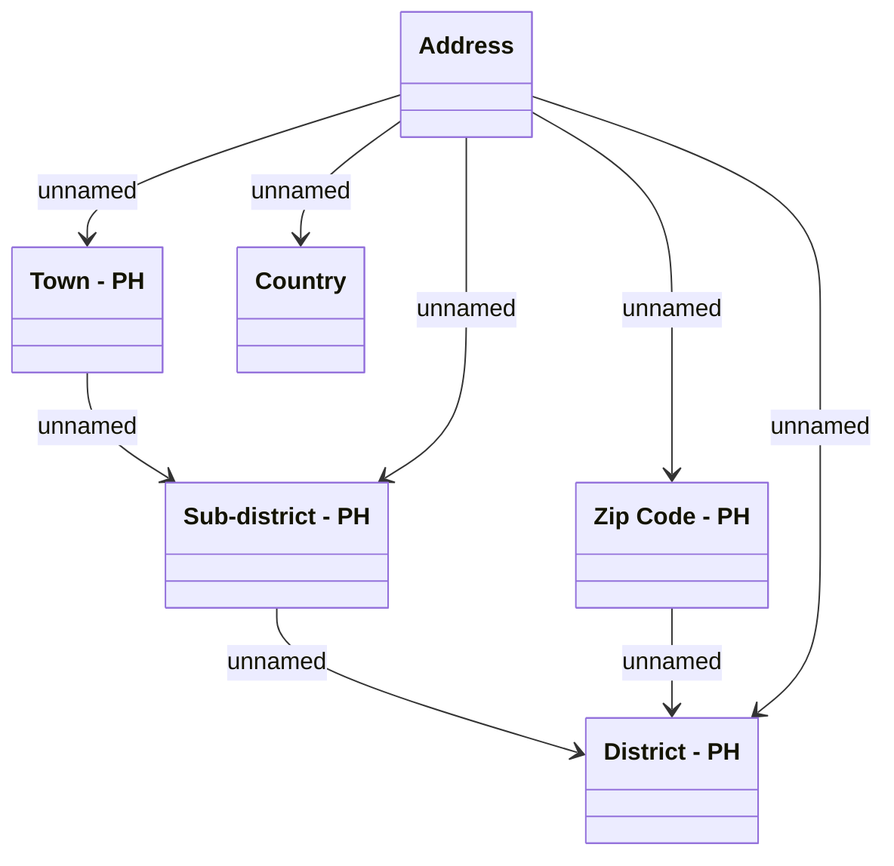

# Address - PH

```mermaid
classDiagram
    class Zip_Code_PH["Zip Code - PH"]
    class Sub_district_PH["Sub-district - PH"]
    class Town_PH["Town - PH"]
    class District_PH["District - PH"]
    class Country["Country"]
    class Address["Address"]
    Sub_district_PH --> District_PH : unnamed
    Zip_Code_PH --> District_PH : unnamed
    Town_PH --> Sub_district_PH : unnamed
    Address --> Country : unnamed
    Address --> Sub_district_PH : unnamed
    Address --> Zip_Code_PH : unnamed
    Address --> Town_PH : unnamed
    Address --> District_PH : unnamed
```
