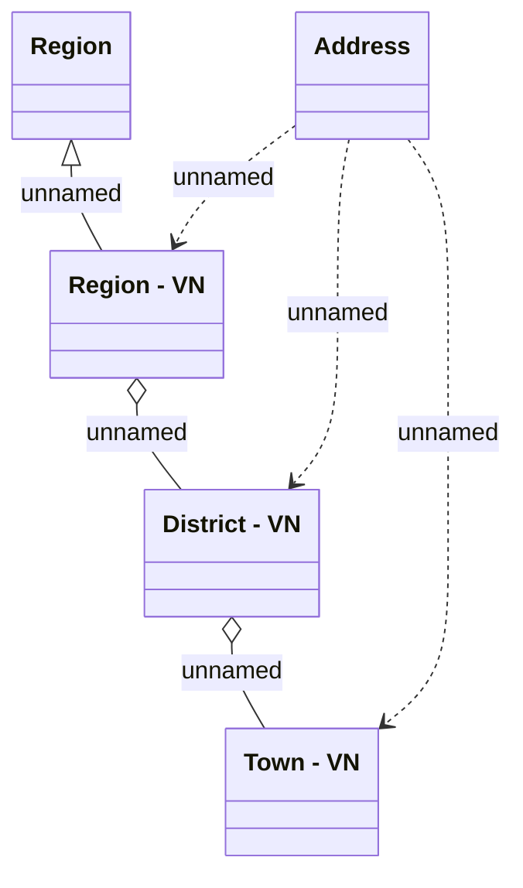

# Address - VN

- **Diagram Type**: Logical
- **Package**: HomerSelect/BSL/Analysis Model/COMMON for BSL/Address/Logical Data Model/VN
- **Diagram ID**: 53322
- **Elements**: 5
- **Connectors**: 6

