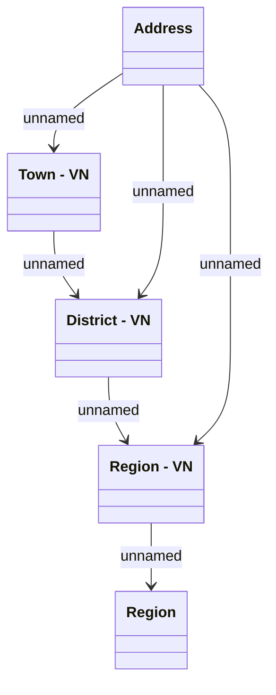

# Address - VN

```mermaid
classDiagram
    class Region["Region"]
    class Town_VN["Town - VN"]
    class District_VN["District - VN"]
    class Region_VN["Region - VN"]
    class Address["Address"]
    Region_VN --> Region : unnamed
    District_VN --> Region_VN : unnamed
    Town_VN --> District_VN : unnamed
    Address --> Town_VN : unnamed
    Address --> Region_VN : unnamed
    Address --> District_VN : unnamed
```
