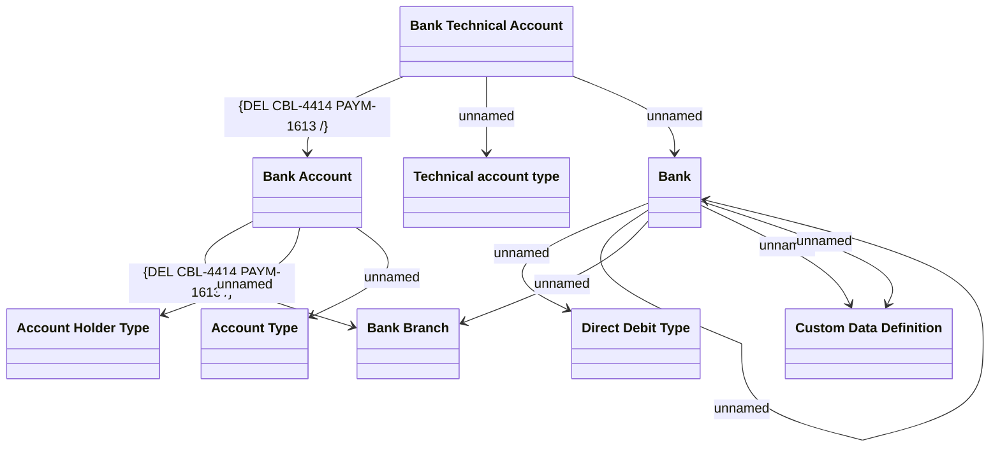

# Common - Bank account

```mermaid
classDiagram
    class Custom_Data_Definition["Custom Data Definition"]
    class Technical_account_type["Technical account type"]
    class Bank_Technical_Account["Bank Technical Account"]
    class Direct_Debit_Type["Direct Debit Type"]
    class Account_Type["Account Type"]
    class Account_Holder_Type["Account Holder Type"]
    class Bank["Bank"]
    class Bank_Branch["Bank Branch"]
    class Bank_Account["Bank Account"]
    Bank_Technical_Account --> Bank_Account : {DEL CBL-4414 PAYM-1613 /}
    Bank_Account --> Bank_Branch : {DEL CBL-4414 PAYM-1613 /}
    Bank_Account --> Account_Holder_Type : unnamed
    Bank_Account --> Account_Type : unnamed
    Bank_Technical_Account --> Technical_account_type : unnamed
    Bank --> Direct_Debit_Type : unnamed
    Bank --> Bank : unnamed
    Bank --> Bank_Branch : unnamed
    Bank --> Custom_Data_Definition : unnamed
    Bank --> Custom_Data_Definition : unnamed
    Bank_Technical_Account --> Bank : unnamed
```
