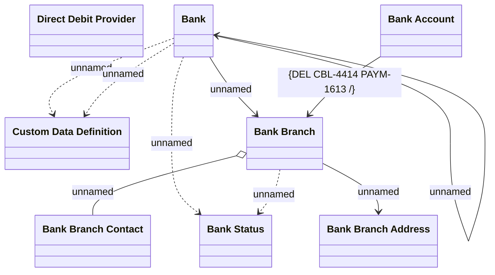

# Bank Management

- **Diagram Type**: Logical
- **Package**: HomerSelect/BSL/Analysis Model/COMMON for BSL/Bank Management/Bank management/Logical Data Model
- **Diagram ID**: 152608
- **Elements**: 8
- **Connectors**: 9

