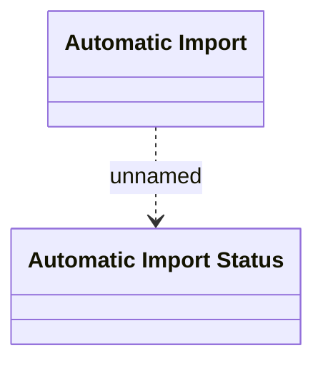

# Automatic Import Queue

- **Diagram Type**: Logical
- **Package**: HomerSelect/BSL/Analysis Model/COMMON for BSL/COMMON for Common for BSL/Logical Data Model/Automatic Import
- **Diagram ID**: 93350
- **Elements**: 2
- **Connectors**: 1

