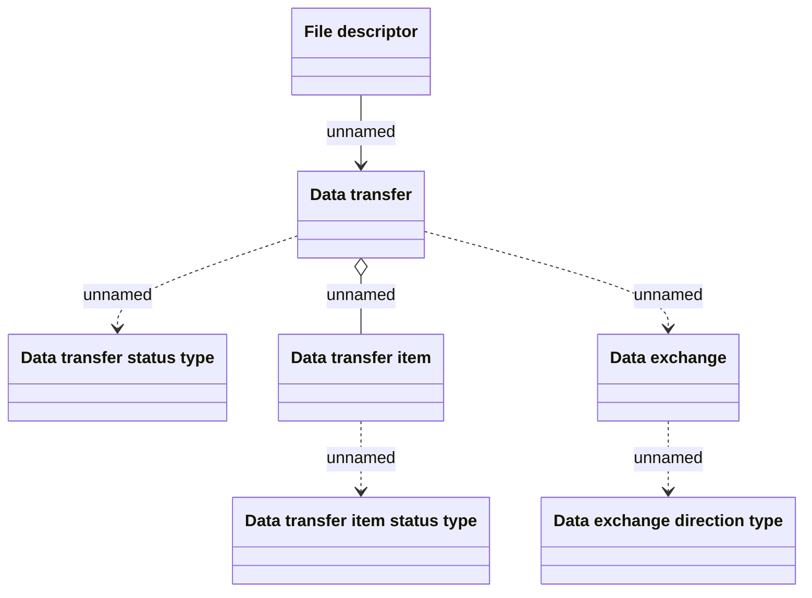

# Data Import Structure

- **Diagram Type**: Logical
- **Package**: HomerSelect/BSL/Analysis Model/COMMON for BSL/COMMON for Common for BSL/Logical Data Model/Data Import Structure
- **Diagram ID**: 93351
- **Elements**: 7
- **Connectors**: 6

