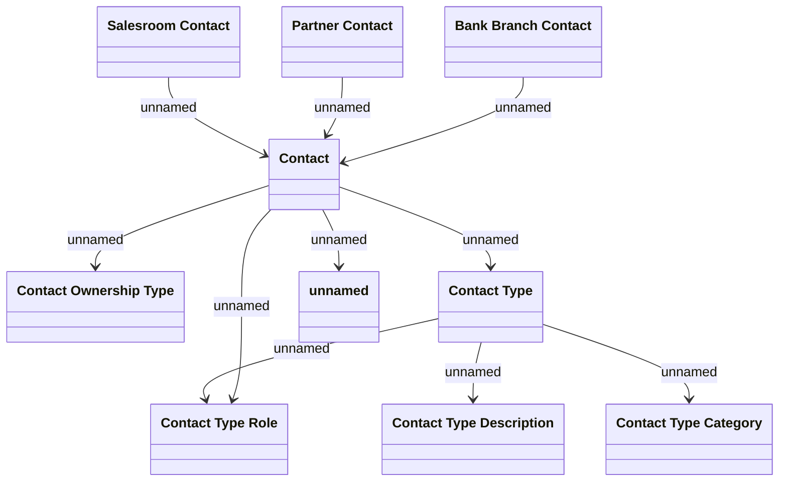

# Common - Contact

```mermaid
classDiagram
    class Contact_Ownership_Type["Contact Ownership Type"]
    class Bank_Branch_Contact["Bank Branch Contact"]
    class Contact_Type_Category["Contact Type Category"]
    class Contact_Type_Description["Contact Type Description"]
    class Contact_Type_Role["Contact Type Role"]
    class Contact_Type["Contact Type"]
    class Salesroom_Contact["Salesroom Contact"]
    class Partner_Contact["Partner Contact"]
    class Contact["Contact"]
    Contact --> Contact_Ownership_Type : unnamed
    Salesroom_Contact --> Contact : unnamed
    Partner_Contact --> Contact : unnamed
    Contact --> unnamed : unnamed
    Contact --> Contact_Type : unnamed
    Contact_Type --> Contact_Type_Role : unnamed
    Contact --> Contact_Type_Role : unnamed
    Contact_Type --> Contact_Type_Description : unnamed
    Contact_Type --> Contact_Type_Category : unnamed
    Bank_Branch_Contact --> Contact : unnamed
```
