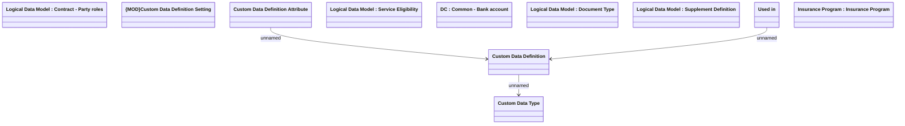

# Custom Data definition

```mermaid
classDiagram
    class Logical_Data_Model_Contract_Party_roles["Logical Data Model : Contract - Party roles"]
    class MOD_Custom_Data_Definition_Setting["{MOD}Custom Data Definition Setting"]
    class Custom_Data_Definition_Attribute["Custom Data Definition Attribute"]
    class Logical_Data_Model_Service_Eligibility["Logical Data Model : Service Eligibility"]
    class DC_Common_Bank_account["DC : Common - Bank account"]
    class Custom_Data_Type["Custom Data Type"]
    class Logical_Data_Model_Document_Type["Logical Data Model : Document Type"]
    class Logical_Data_Model_Supplement_Definition["Logical Data Model : Supplement Definition"]
    class Used_in["Used in"]
    class Insurance_Program_Insurance_Program["Insurance Program : Insurance Program"]
    class Custom_Data_Definition["Custom Data Definition"]
    Custom_Data_Definition_Attribute --> Custom_Data_Definition : unnamed
    Used_in --> Custom_Data_Definition : unnamed
    Custom_Data_Definition --> Custom_Data_Type : unnamed
```
