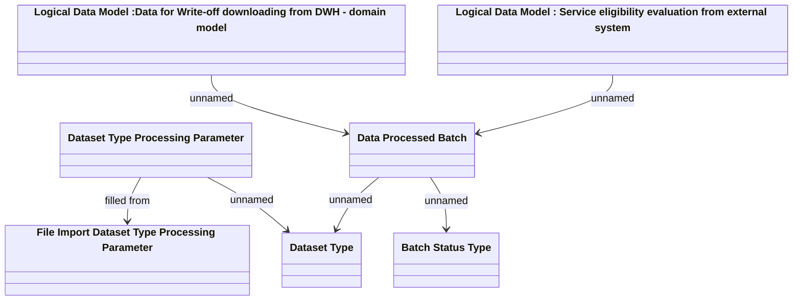

# Data prepared notification - LDM

```mermaid
classDiagram
    class File_Import_Dataset_Type_Processing_Parameter["File Import Dataset Type Processing Parameter"]
    class Dataset_Type_Processing_Parameter["Dataset Type Processing Parameter"]
    class Logical_Data_Model_Service_eligibility_evaluation_from_exter["Logical Data Model : Service eligibility evaluation from external system"]
    class Logical_Data_Model_Data_for_Write_off_downloading_from_DWH_d["Logical Data Model :Data for Write-off downloading from DWH - domain model"]
    class Dataset_Type["Dataset Type"]
    class Batch_Status_Type["Batch Status Type"]
    class Data_Processed_Batch["Data Processed Batch"]
    Logical_Data_Model_Service_eligibility_evaluation_from_exter --> Data_Processed_Batch : unnamed
    Logical_Data_Model_Data_for_Write_off_downloading_from_DWH_d --> Data_Processed_Batch : unnamed
    Data_Processed_Batch --> Batch_Status_Type : unnamed
    Dataset_Type_Processing_Parameter --> Dataset_Type : unnamed
    Data_Processed_Batch --> Dataset_Type : unnamed
    Dataset_Type_Processing_Parameter --> File_Import_Dataset_Type_Processing_Parameter : filled from
```
