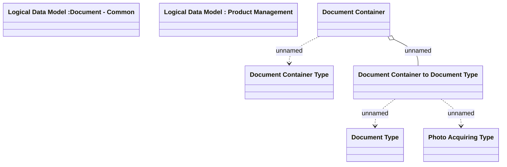

# Document Container

- **Diagram Type**: Logical
- **Package**: HomerSelect/BSL/Analysis Model/COMMON for BSL/Document/Document Container/Logical Data Model
- **Diagram ID**: 124144
- **Elements**: 7
- **Connectors**: 4

