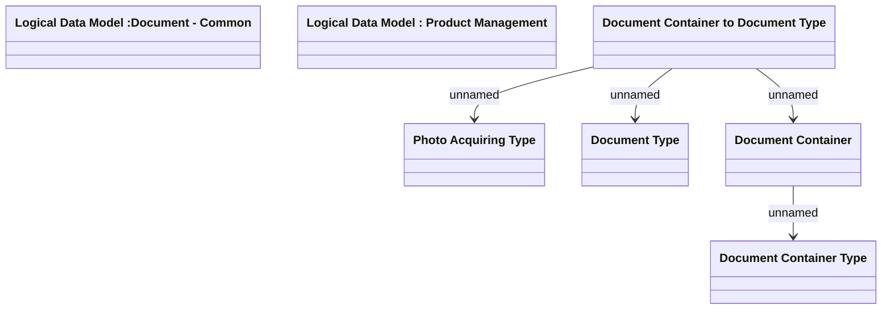

# Document Container

```mermaid
classDiagram
    class Photo_Acquiring_Type["Photo Acquiring Type"]
    class Logical_Data_Model_Document_Common["Logical Data Model :Document - Common"]
    class Logical_Data_Model_Product_Management["Logical Data Model : Product Management"]
    class Document_Container_Type["Document Container Type"]
    class Document_Container_to_Document_Type["Document Container to Document Type"]
    class Document_Type["Document Type"]
    class Document_Container["Document Container"]
    Document_Container_to_Document_Type --> Document_Container : unnamed
    Document_Container_to_Document_Type --> Document_Type : unnamed
    Document_Container --> Document_Container_Type : unnamed
    Document_Container_to_Document_Type --> Photo_Acquiring_Type : unnamed
```
