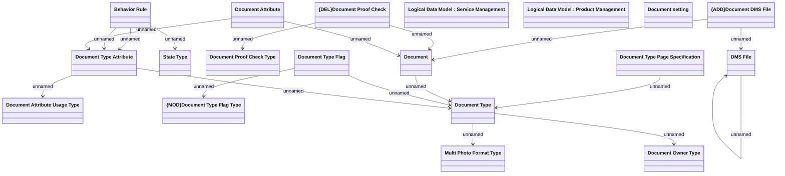

# Document 

```mermaid
classDiagram
    class Document_Type_Page_Specification["Document Type Page Specification"]
    class ADD_Document_DMS_File["{ADD}Document DMS File"]
    class Document_Attribute_Usage_Type["Document Attribute Usage Type"]
    class State_Type["State Type"]
    class Behavior_Rule["Behavior Rule"]
    class Document_Proof_Check_Type["Document Proof Check Type"]
    class DEL_Document_Proof_Check["{DEL}Document Proof Check"]
    class MOD_Document_Type_Flag_Type["{MOD}Document Type Flag Type"]
    class Multi_Photo_Format_Type["Multi Photo Format Type"]
    class Document_Owner_Type["Document Owner Type"]
    class Logical_Data_Model_Service_Management["Logical Data Model : Service Management"]
    class DMS_File["DMS File"]
    class Logical_Data_Model_Product_Management["Logical Data Model : Product Management"]
    class Document_Type_Flag["Document Type Flag"]
    class Document_setting["Document setting"]
    class Document_Type["Document Type"]
    class Document_Attribute["Document Attribute"]
    class Document_Type_Attribute["Document Type Attribute"]
    class Document["Document"]
    Document_Type_Flag --> MOD_Document_Type_Flag_Type : unnamed
    ADD_Document_DMS_File --> DMS_File : unnamed
    ADD_Document_DMS_File --> Document : unnamed
    Behavior_Rule --> State_Type : unnamed
    Behavior_Rule --> Document_Type_Attribute : unnamed
    Behavior_Rule --> Document_Type_Attribute : unnamed
    DEL_Document_Proof_Check --> Document : unnamed
    Document_Type_Page_Specification --> Document_Type : unnamed
    DMS_File --> DMS_File : unnamed
    Document --> Document_Type : unnamed
    Document_Type_Flag --> Document_Type : unnamed
    Document_Type --> Multi_Photo_Format_Type : unnamed
    Document_Type --> Document_Owner_Type : unnamed
    Document_Attribute --> Document_Type_Attribute : unnamed
    Document_Attribute --> Document : unnamed
    Document_Type_Attribute --> Document_Attribute_Usage_Type : unnamed
    Document_Type_Attribute --> Document_Type : unnamed
    DEL_Document_Proof_Check --> Document_Proof_Check_Type : unnamed
```
