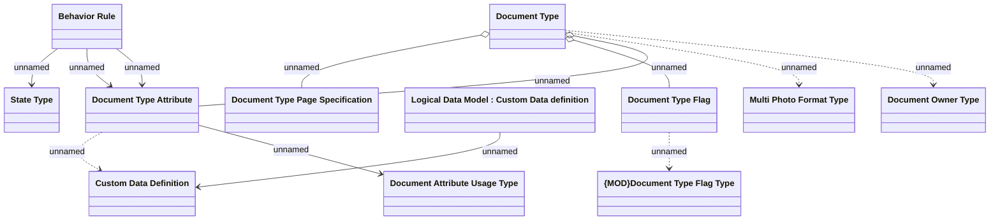

# Document Type

- **Diagram Type**: Logical
- **Package**: HomerSelect/BSL/Analysis Model/COMMON for BSL/Document/Document Type Definition/Logical Data Model
- **Diagram ID**: 164326
- **Elements**: 12
- **Connectors**: 12

