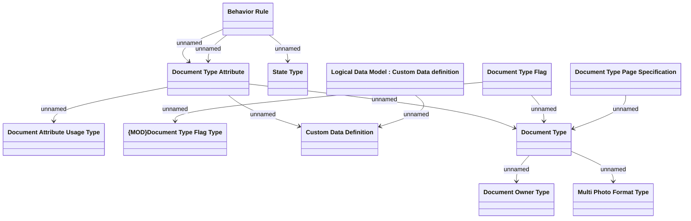

# Document Type

```mermaid
classDiagram
    class Document_Type_Page_Specification["Document Type Page Specification"]
    class Document_Attribute_Usage_Type["Document Attribute Usage Type"]
    class State_Type["State Type"]
    class Behavior_Rule["Behavior Rule"]
    class MOD_Document_Type_Flag_Type["{MOD}Document Type Flag Type"]
    class Multi_Photo_Format_Type["Multi Photo Format Type"]
    class Custom_Data_Definition["Custom Data Definition"]
    class Logical_Data_Model_Custom_Data_definition["Logical Data Model : Custom Data definition"]
    class Document_Owner_Type["Document Owner Type"]
    class Document_Type_Flag["Document Type Flag"]
    class Document_Type_Attribute["Document Type Attribute"]
    class Document_Type["Document Type"]
    Document_Type --> Document_Owner_Type : unnamed
    Document_Type --> Multi_Photo_Format_Type : unnamed
    Document_Type_Attribute --> Document_Type : unnamed
    Document_Type_Attribute --> Document_Attribute_Usage_Type : unnamed
    Document_Type_Attribute --> Custom_Data_Definition : unnamed
    Document_Type_Flag --> Document_Type : unnamed
    Document_Type_Flag --> MOD_Document_Type_Flag_Type : unnamed
    Logical_Data_Model_Custom_Data_definition --> Custom_Data_Definition : unnamed
    Behavior_Rule --> Document_Type_Attribute : unnamed
    Behavior_Rule --> Document_Type_Attribute : unnamed
    Behavior_Rule --> State_Type : unnamed
    Document_Type_Page_Specification --> Document_Type : unnamed
```
