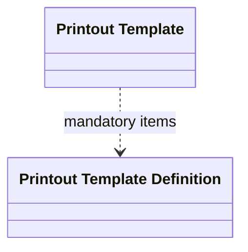

# Printout Template

- **Diagram Type**: Logical
- **Package**: HomerSelect/BSL/Analysis Model/COMMON for BSL/Document/Printout Template/Logical Data Model
- **Diagram ID**: 75697
- **Elements**: 2
- **Connectors**: 1

