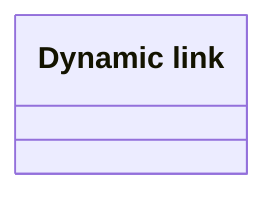

# Logical data model

- **Diagram Type**: Logical
- **Package**: HomerSelect/BSL/Analysis Model/COMMON for BSL/Dynamic link/Logical data model
- **Diagram ID**: 121023
- **Elements**: 1
- **Connectors**: 0

