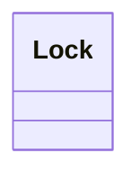

# Logical data model

- **Diagram Type**: Logical
- **Package**: HomerSelect/BSL/Analysis Model/COMMON for BSL/Entity locking mechanism for WS/Logical data model
- **Diagram ID**: 129578
- **Elements**: 1
- **Connectors**: 0

