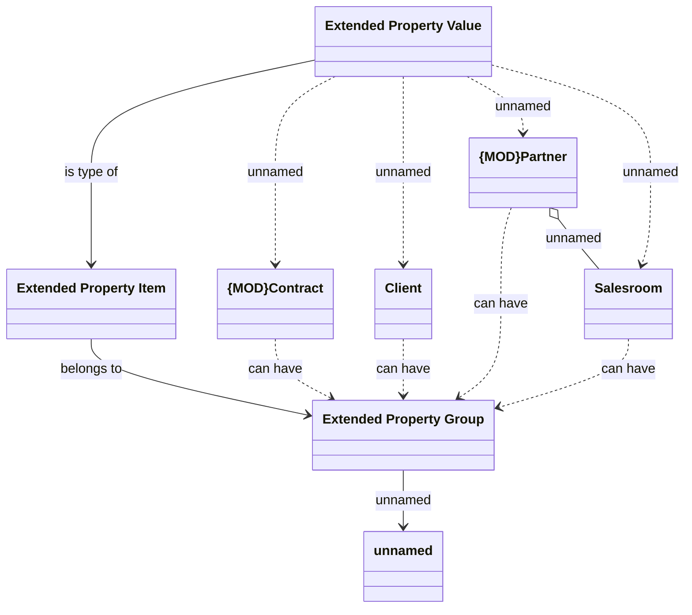

# Common - Extended Properties

- **Diagram Type**: Logical
- **Package**: HomerSelect/BSL/Analysis Model/COMMON for BSL/Extended properties/Logical Data Model
- **Diagram ID**: 136390
- **Elements**: 8
- **Connectors**: 12

