# Global parameters - OVERVIEW

- **Diagram Type**: Logical
- **Package**: HomerSelect/BSL/Analysis Model/COMMON for BSL/Global system parameters
- **Diagram ID**: 110443
- **Elements**: 17
- **Connectors**: 8

```mermaid
classDiagram
    class Technical_Technical_Global_Parameter["Technical : Technical Global Parameter"]
    class Technical_Global_Parameter["Technical Global Parameter"]
    class Product_Catalogue_Product_Catalogue_Global_Parameter["Product Catalogue : Product Catalogue Global Parameter"]
    class Global_system_parameters_Sales_Network_Global_Parameter["Global system parameters : Sales Network Global Parameter"]
    class MOD_Sales_Network_Global_Parameter["{MOD}Sales Network Global Parameter"]
    class Global_system_parameters_Card_Management_Global_Parameter["Global system parameters : Card Management Global Parameter"]
    class Card_Management_Global_Parameter["Card Management Global Parameter"]
    class Global_system_parameters_Payment_Management_Global_Parameter["Global system parameters : Payment Management Global Parameter"]
    class Global_system_parameters_Contract_Management_Global_Paramete["Global system parameters : Contract Management Global Parameter"]
    class Global_system_parameters_Contract_Origination_Global_Paramet["Global system parameters : Contract Origination Global Parameter"]
    class Global_system_parameters_General_Global_Parameter["Global system parameters : General Global Parameter"]
    class MOD_Payment_Management_Global_Parameter["{MOD}Payment Management Global Parameter"]
    class General_Global_Parameter["General Global Parameter"]
    class MOD_Contract_Origination_Global_Parameter["{MOD}Contract Origination Global Parameter"]
    class MOD_Contract_Management_Global_Parameter["{MOD}Contract Management Global Parameter"]
    class MOD_Product_Catalog_Global_Parameter["{MOD}Product Catalog Global Parameter"]
    class Global_Parameter["Global Parameter"]
    Global_Parameter ..> MOD_Product_Catalog_Global_Parameter : filled from
    Global_Parameter ..> MOD_Contract_Management_Global_Parameter : filled from
    Global_Parameter ..> MOD_Contract_Origination_Global_Parameter : filled from
    Global_Parameter ..> General_Global_Parameter : filled from
    Global_Parameter ..> MOD_Payment_Management_Global_Parameter : filled from
    Global_Parameter ..> Card_Management_Global_Parameter : filled from
    Global_Parameter ..> MOD_Sales_Network_Global_Parameter : filled from
    Global_Parameter ..> Technical_Global_Parameter : filled from
```

