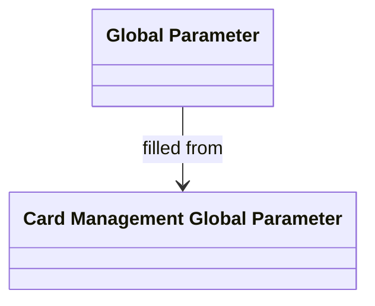

# Card Management Global Parameter

```mermaid
classDiagram
    class Card_Management_Global_Parameter["Card Management Global Parameter"]
    class Global_Parameter["Global Parameter"]
    Global_Parameter --> Card_Management_Global_Parameter : filled from
```
