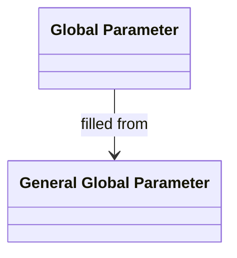

# General Global Parameter

```mermaid
classDiagram
    class Global_Parameter["Global Parameter"]
    class General_Global_Parameter["General Global Parameter"]
    Global_Parameter --> General_Global_Parameter : filled from
```
