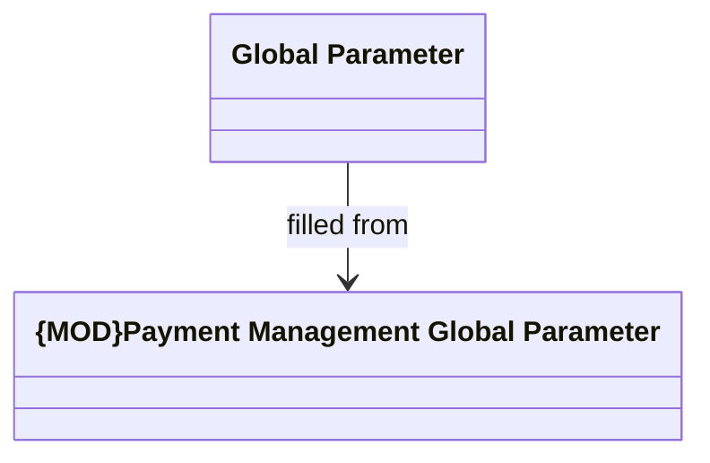

# Payment Management Global Parameter

```mermaid
classDiagram
    class Global_Parameter["Global Parameter"]
    class MOD_Payment_Management_Global_Parameter["{MOD}Payment Management Global Parameter"]
    Global_Parameter --> MOD_Payment_Management_Global_Parameter : filled from
```
