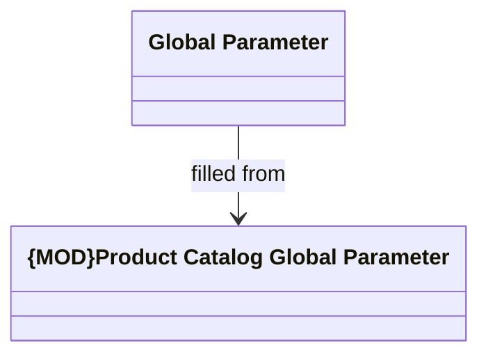

# Product Catalog Global Parameter

```mermaid
classDiagram
    class MOD_Product_Catalog_Global_Parameter["{MOD}Product Catalog Global Parameter"]
    class Global_Parameter["Global Parameter"]
    Global_Parameter --> MOD_Product_Catalog_Global_Parameter : filled from
```
