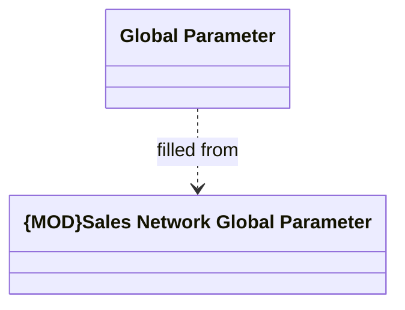

# Sales Network Global Parameter

- **Diagram Type**: Logical
- **Package**: HomerSelect/BSL/Analysis Model/COMMON for BSL/Global system parameters/Sales Network
- **Diagram ID**: 104319
- **Elements**: 2
- **Connectors**: 1

