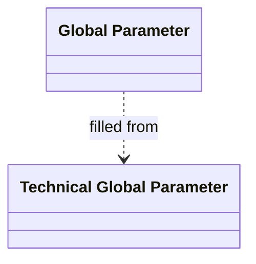

# Technical Global Parameter

- **Diagram Type**: Logical
- **Package**: HomerSelect/BSL/Analysis Model/COMMON for BSL/Global system parameters/Technical
- **Diagram ID**: 148789
- **Elements**: 2
- **Connectors**: 1

