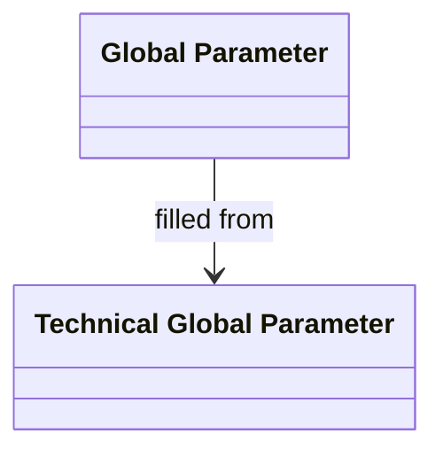

# Technical Global Parameter

```mermaid
classDiagram
    class Technical_Global_Parameter["Technical Global Parameter"]
    class Global_Parameter["Global Parameter"]
    Global_Parameter --> Technical_Global_Parameter : filled from
```
