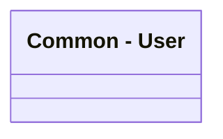

# Common - Inbox

- **Diagram Type**: Logical
- **Package**: HomerSelect/BSL/Analysis Model/COMMON for BSL/Inbox/Logical Data Model
- **Diagram ID**: 61615
- **Elements**: 1
- **Connectors**: 0

```mermaid
classDiagram
    class Common_User["Common - User"]
```
