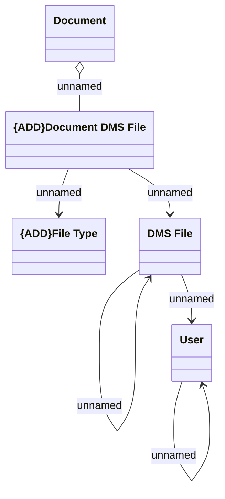

# Common - Uploaded document

- **Diagram Type**: Logical
- **Package**: HomerSelect/BSL/Analysis Model/COMMON for BSL/Integration with document archive/Logical data model
- **Diagram ID**: 134201
- **Elements**: 5
- **Connectors**: 6

