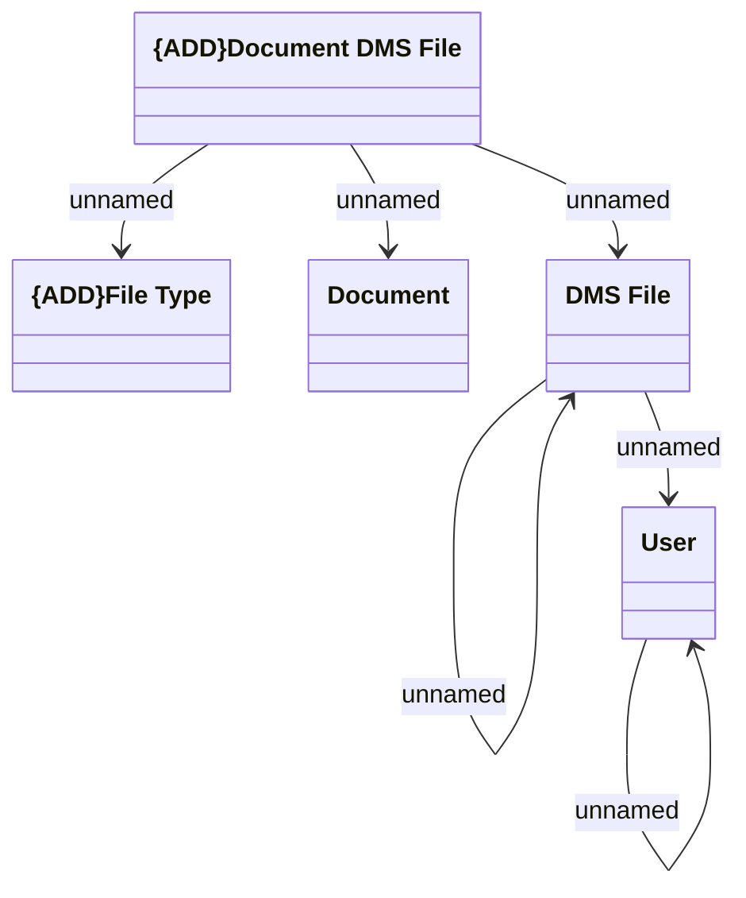

# Common - Uploaded document

```mermaid
classDiagram
    class ADD_File_Type["{ADD}File Type"]
    class ADD_Document_DMS_File["{ADD}Document DMS File"]
    class User["User"]
    class Document["Document"]
    class DMS_File["DMS File"]
    ADD_Document_DMS_File --> DMS_File : unnamed
    DMS_File --> DMS_File : unnamed
    User --> User : unnamed
    DMS_File --> User : unnamed
    ADD_Document_DMS_File --> ADD_File_Type : unnamed
    ADD_Document_DMS_File --> Document : unnamed
```
