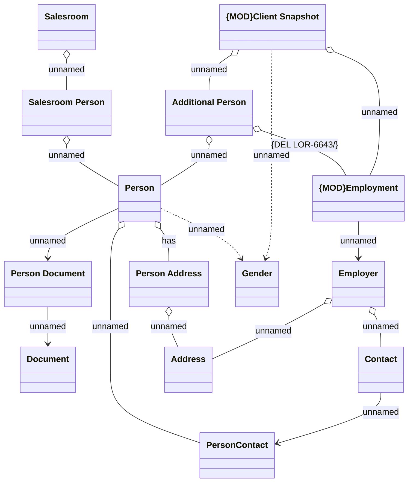

# Common - Person

- **Diagram Type**: Logical
- **Package**: HomerSelect/BSL/Analysis Model/COMMON for BSL/Person/Logical Data Model
- **Diagram ID**: 144549
- **Elements**: 14
- **Connectors**: 17

