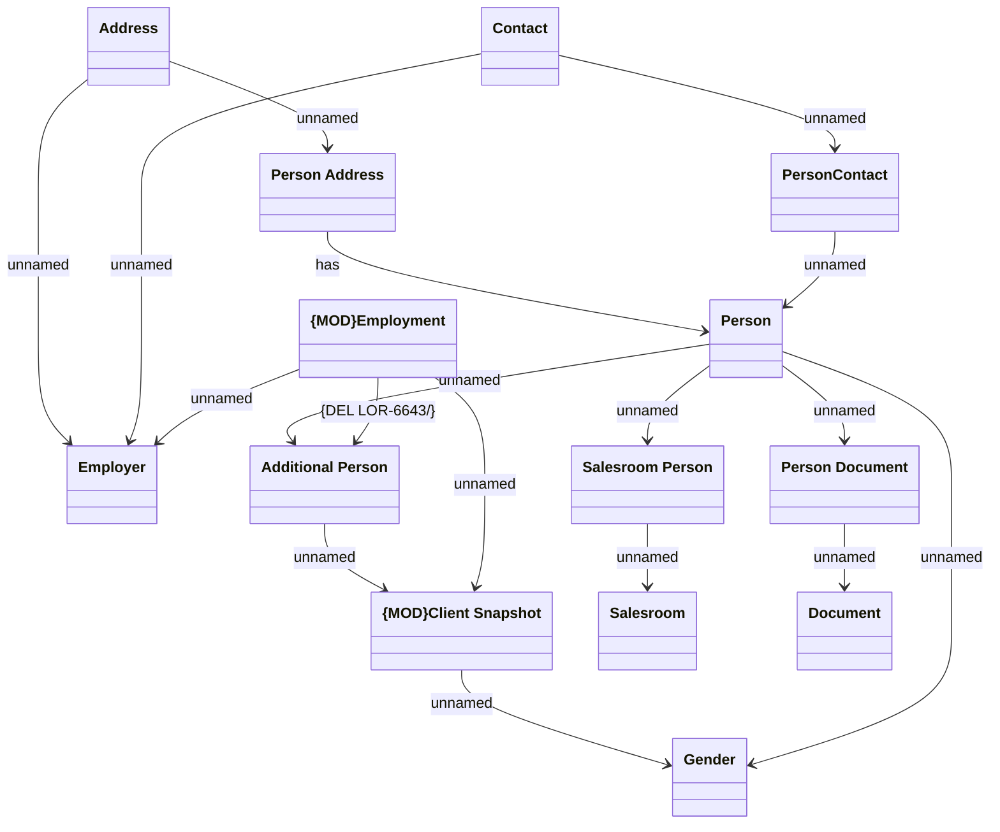

# Common - Person

```mermaid
classDiagram
    class Employer["Employer"]
    class MOD_Employment["{MOD}Employment"]
    class MOD_Client_Snapshot["{MOD}Client Snapshot"]
    class Salesroom["Salesroom"]
    class Document["Document"]
    class PersonContact["PersonContact"]
    class Person_Document["Person Document"]
    class Person_Address["Person Address"]
    class Salesroom_Person["Salesroom Person"]
    class Additional_Person["Additional Person"]
    class Contact["Contact"]
    class Person["Person"]
    class Address["Address"]
    class Gender["Gender"]
    Address --> Person_Address : unnamed
    Salesroom_Person --> Salesroom : unnamed
    Person_Document --> Document : unnamed
    Person --> Person_Document : unnamed
    Person --> Salesroom_Person : unnamed
    PersonContact --> Person : unnamed
    Person_Address --> Person : has
    Person --> Gender : unnamed
    Contact --> PersonContact : unnamed
    MOD_Employment --> Employer : unnamed
    MOD_Employment --> Additional_Person : {DEL LOR-6643/}
    MOD_Employment --> MOD_Client_Snapshot : unnamed
    Additional_Person --> MOD_Client_Snapshot : unnamed
    MOD_Client_Snapshot --> Gender : unnamed
    Person --> Additional_Person : unnamed
    Contact --> Employer : unnamed
    Address --> Employer : unnamed
```
