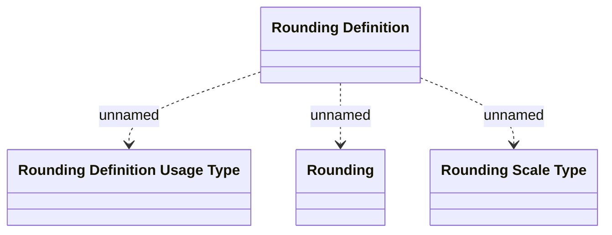

# Rounding - LDM

- **Diagram Type**: Logical
- **Package**: HomerSelect/BSL/Analysis Model/COMMON for BSL/Rounding/Logical Data model
- **Diagram ID**: 100292
- **Elements**: 4
- **Connectors**: 3

