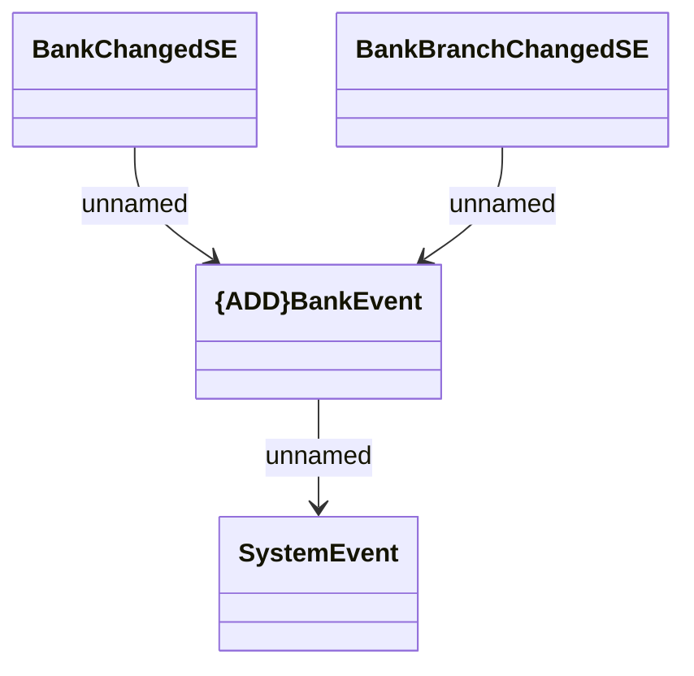

# Bank system events schema

```mermaid
classDiagram
    class BankChangedSE["BankChangedSE"]
    class BankBranchChangedSE["BankBranchChangedSE"]
    class ADD_BankEvent["{ADD}BankEvent"]
    class SystemEvent["SystemEvent"]
    ADD_BankEvent --> SystemEvent : unnamed
    BankChangedSE --> ADD_BankEvent : unnamed
    BankBranchChangedSE --> ADD_BankEvent : unnamed
```
