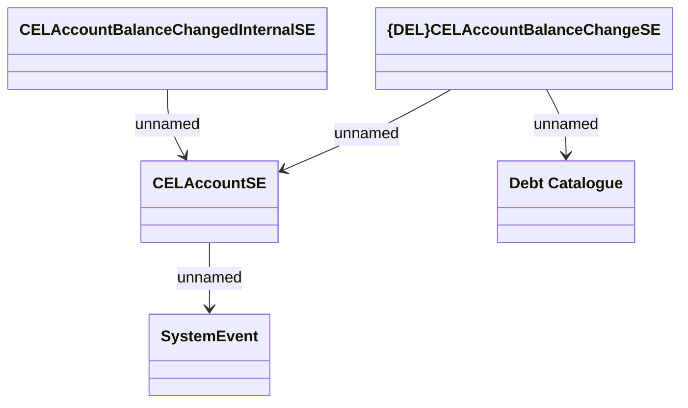

# CEL Account system event schema

```mermaid
classDiagram
    class CELAccountBalanceChangedInternalSE["CELAccountBalanceChangedInternalSE"]
    class Debt_Catalogue["Debt Catalogue"]
    class SystemEvent["SystemEvent"]
    class DEL_CELAccountBalanceChangeSE["{DEL}CELAccountBalanceChangeSE"]
    class CELAccountSE["CELAccountSE"]
    CELAccountBalanceChangedInternalSE --> CELAccountSE : unnamed
    DEL_CELAccountBalanceChangeSE --> CELAccountSE : unnamed
    CELAccountSE --> SystemEvent : unnamed
    DEL_CELAccountBalanceChangeSE --> Debt_Catalogue : unnamed
```
