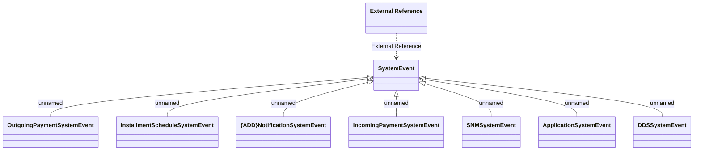

# COMMON for system events

- **Diagram Type**: Logical
- **Package**: HomerSelect/BSL/Analysis Model/COMMON for BSL/System events/Logical data model
- **Diagram ID**: 164611
- **Elements**: 9
- **Connectors**: 8

