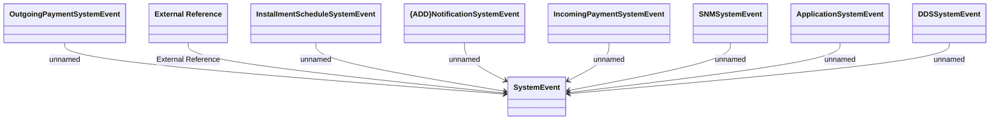

# COMMON for system events

```mermaid
classDiagram
    class ADD_NotificationSystemEvent["{ADD}NotificationSystemEvent"]
    class ApplicationSystemEvent["ApplicationSystemEvent"]
    class SNMSystemEvent["SNMSystemEvent"]
    class IncomingPaymentSystemEvent["IncomingPaymentSystemEvent"]
    class DDSSystemEvent["DDSSystemEvent"]
    class OutgoingPaymentSystemEvent["OutgoingPaymentSystemEvent"]
    class InstallmentScheduleSystemEvent["InstallmentScheduleSystemEvent"]
    class External_Reference["External Reference"]
    class SystemEvent["SystemEvent"]
    OutgoingPaymentSystemEvent --> SystemEvent : unnamed
    External_Reference --> SystemEvent : External Reference
    InstallmentScheduleSystemEvent --> SystemEvent : unnamed
    ADD_NotificationSystemEvent --> SystemEvent : unnamed
    IncomingPaymentSystemEvent --> SystemEvent : unnamed
    SNMSystemEvent --> SystemEvent : unnamed
    ApplicationSystemEvent --> SystemEvent : unnamed
    DDSSystemEvent --> SystemEvent : unnamed
```
