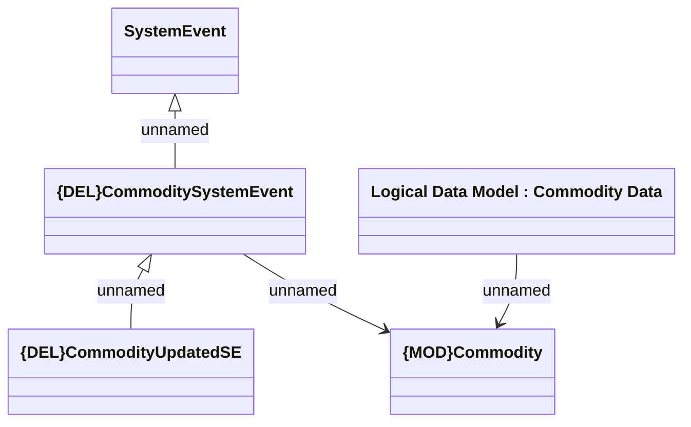

# CommoditySystemEvent schema

- **Diagram Type**: Logical
- **Package**: HomerSelect/BSL/Analysis Model/COMMON for BSL/System events/Logical data model
- **Diagram ID**: 164623
- **Elements**: 5
- **Connectors**: 4

