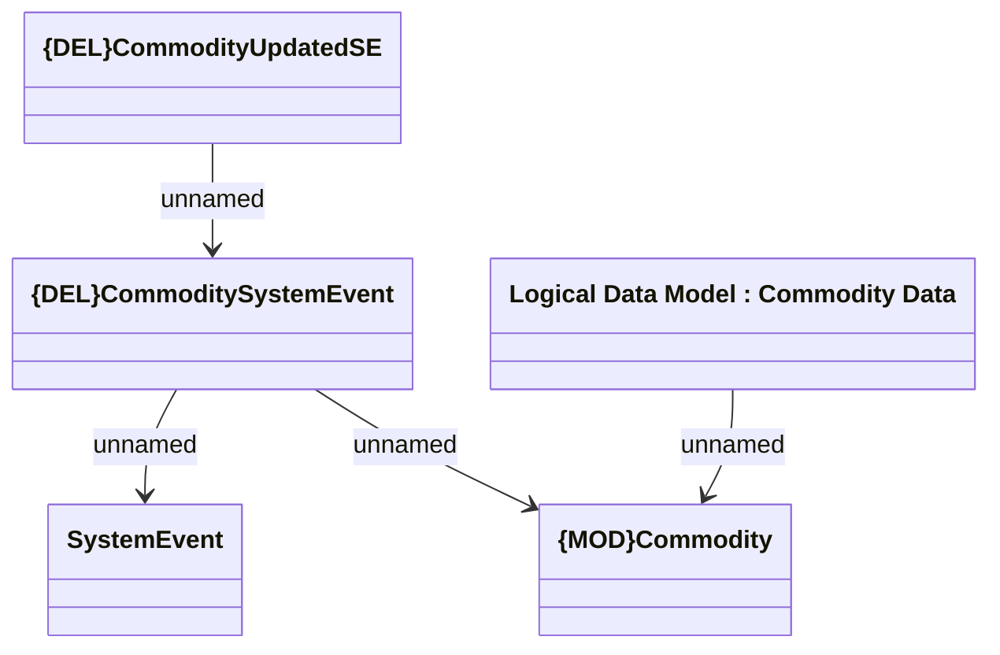

# CommoditySystemEvent schema

```mermaid
classDiagram
    class Logical_Data_Model_Commodity_Data["Logical Data Model : Commodity Data"]
    class MOD_Commodity["{MOD}Commodity"]
    class DEL_CommodityUpdatedSE["{DEL}CommodityUpdatedSE"]
    class DEL_CommoditySystemEvent["{DEL}CommoditySystemEvent"]
    class SystemEvent["SystemEvent"]
    DEL_CommoditySystemEvent --> SystemEvent : unnamed
    DEL_CommodityUpdatedSE --> DEL_CommoditySystemEvent : unnamed
    DEL_CommoditySystemEvent --> MOD_Commodity : unnamed
    Logical_Data_Model_Commodity_Data --> MOD_Commodity : unnamed
```
