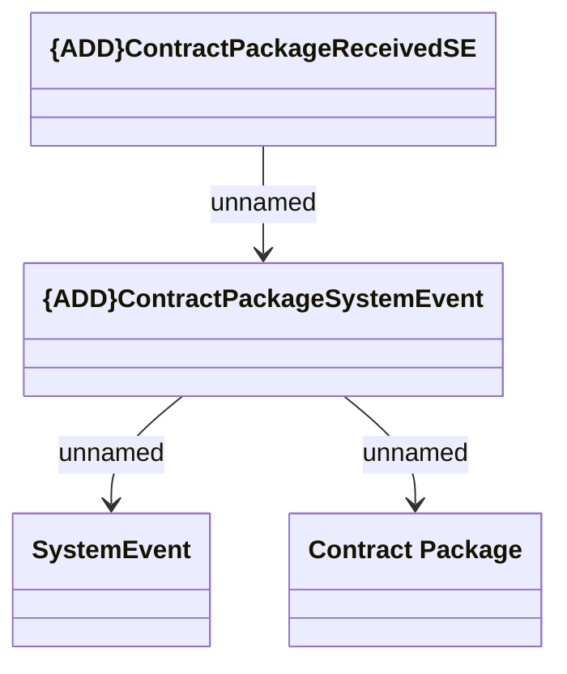

# Contract package system event schema

```mermaid
classDiagram
    class Contract_Package["Contract Package"]
    class ADD_ContractPackageReceivedSE["{ADD}ContractPackageReceivedSE"]
    class ADD_ContractPackageSystemEvent["{ADD}ContractPackageSystemEvent"]
    class SystemEvent["SystemEvent"]
    ADD_ContractPackageSystemEvent --> SystemEvent : unnamed
    ADD_ContractPackageReceivedSE --> ADD_ContractPackageSystemEvent : unnamed
    ADD_ContractPackageSystemEvent --> Contract_Package : unnamed
```
