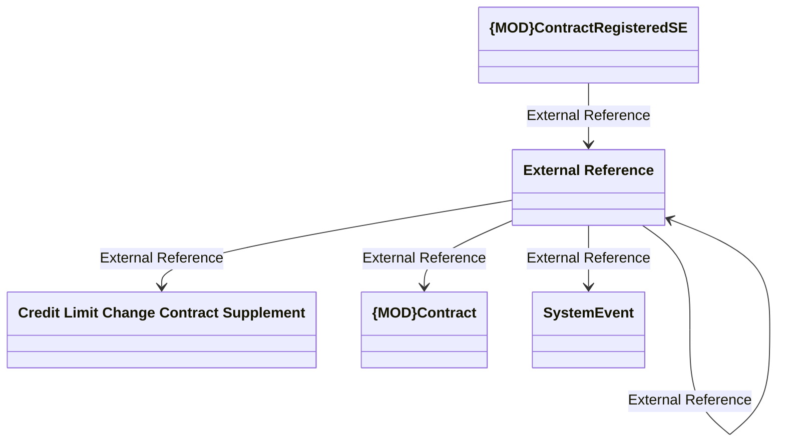

# ContractSystemEvent schema

```mermaid
classDiagram
    class External_Reference["External Reference"]
    class External_Reference["External Reference"]
    class External_Reference["External Reference"]
    class External_Reference["External Reference"]
    class External_Reference["External Reference"]
    class MOD_ContractRegisteredSE["{MOD}ContractRegisteredSE"]
    class External_Reference["External Reference"]
    class External_Reference["External Reference"]
    class External_Reference["External Reference"]
    class External_Reference["External Reference"]
    class External_Reference["External Reference"]
    class External_Reference["External Reference"]
    class External_Reference["External Reference"]
    class External_Reference["External Reference"]
    class External_Reference["External Reference"]
    class External_Reference["External Reference"]
    class External_Reference["External Reference"]
    class External_Reference["External Reference"]
    class External_Reference["External Reference"]
    class External_Reference["External Reference"]
    class Credit_Limit_Change_Contract_Supplement["Credit Limit Change Contract Supplement"]
    class External_Reference["External Reference"]
    class MOD_Contract["{MOD}Contract"]
    class External_Reference["External Reference"]
    class External_Reference["External Reference"]
    class External_Reference["External Reference"]
    class External_Reference["External Reference"]
    class External_Reference["External Reference"]
    class External_Reference["External Reference"]
    class External_Reference["External Reference"]
    class External_Reference["External Reference"]
    class External_Reference["External Reference"]
    class External_Reference["External Reference"]
    class External_Reference["External Reference"]
    class SystemEvent["SystemEvent"]
    class External_Reference["External Reference"]
    External_Reference --> External_Reference : External Reference
    External_Reference --> External_Reference : External Reference
    External_Reference --> External_Reference : External Reference
    MOD_ContractRegisteredSE --> External_Reference : External Reference
    External_Reference --> External_Reference : External Reference
    External_Reference --> External_Reference : External Reference
    External_Reference --> External_Reference : External Reference
    External_Reference --> External_Reference : External Reference
    External_Reference --> External_Reference : External Reference
    External_Reference --> External_Reference : External Reference
    External_Reference --> External_Reference : External Reference
    External_Reference --> SystemEvent : External Reference
    External_Reference --> MOD_Contract : External Reference
    External_Reference --> Credit_Limit_Change_Contract_Supplement : External Reference
    External_Reference --> External_Reference : External Reference
    External_Reference --> External_Reference : External Reference
    External_Reference --> External_Reference : External Reference
    External_Reference --> External_Reference : External Reference
    External_Reference --> External_Reference : External Reference
    External_Reference --> External_Reference : External Reference
    External_Reference --> External_Reference : External Reference
    External_Reference --> External_Reference : External Reference
    External_Reference --> External_Reference : External Reference
    External_Reference --> External_Reference : External Reference
    External_Reference --> External_Reference : External Reference
    External_Reference --> External_Reference : External Reference
    External_Reference --> External_Reference : External Reference
    External_Reference --> External_Reference : External Reference
    External_Reference --> External_Reference : External Reference
    External_Reference --> External_Reference : External Reference
    External_Reference --> External_Reference : External Reference
    External_Reference --> External_Reference : External Reference
    External_Reference --> External_Reference : External Reference
    External_Reference --> External_Reference : External Reference
    External_Reference --> External_Reference : External Reference
```
